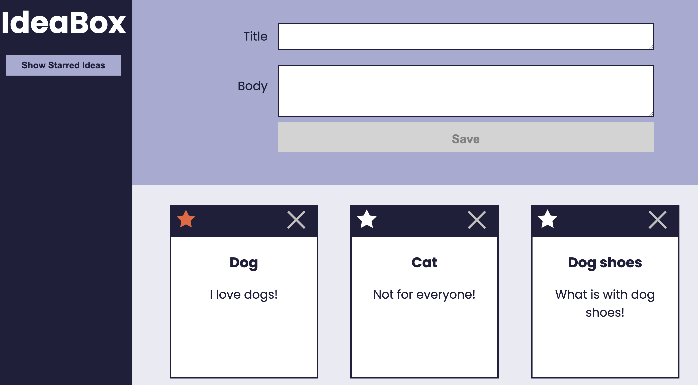

# IdeaBox

### Abstract:
This project allows a user to keep track of ideas.  The interface allows the user to display ideas, create favorite ideas and display those seperately, and delete ideas.  

---
### Installation Instructions:
The user can visit this web site: 
https://ericahagle.github.io/ideabox/

---
### Preview of App:

---
### Context:
We worked on this project as our Mod 1 Group Assignment and had one week to work on it. As of the submission of the project we will have completed Week 4 of Mod 1 of the Front End Engineering program at Turing School of Software and Design.

---
### Contributors:
#### Dev Team:
- [Erica Hagle](https://github.com/ericahagle)
- [Ben Rosner](https://github.com/ben-rosner-williamsburg)
- [Chris Butler](https://github.com/butlertree)
#### Project Manager:
- [Travis Rollins](https://github.com/kalikoze)
---
### Learning Goals:
- Gain an understanding of how to write clean HTML and CSS to match a provided comp
- Understand how a developer might separate the data model from the DOM model
- Incorporate & iterate over arrays in order to filter what is being displayed
- Craft code with clean style, using small functions that show trends toward DRYness, SRP, and purity
---
### Wins + Challenges:

- Wins
  - We were able to complete all required iterations (0-4) with no known bugs remaining.  
  - We also added a couple of small enhancements.
  - We were able to set up a GitHub Project and organize the work using tickets so that we all knew what each of us was working on at any given time.  This also allowed us to more easily to keep track of completed and remaining work.   
  - We maintained strong communication throughout the project.  
- Challenges
  - Initially we experienced challenges around merge conflicts.
    - After unsuccessfully troubleshooting as a team we reached out to our instructors for guidance. Travis was able to point us in the correct direction. We then worked through subsequent merge conflicts together until we were comfortable enough to address them individually as they came up later.     
  - Time zone differences made it difficult to work together at the same time.  
    - We scheduled ahead the times that knew we were going to work together and checked in fairly regularly to see when each of us was available for adhoc meetings.  
  - We struggled with setting up the enable and disable functionality of the show starred ideas button to work as we would have liked. 
    - Eventually after working through multiple ideas we decided as a team that since it wasn't strictly a requirement we would stop working on it and move forward.   
  

---
